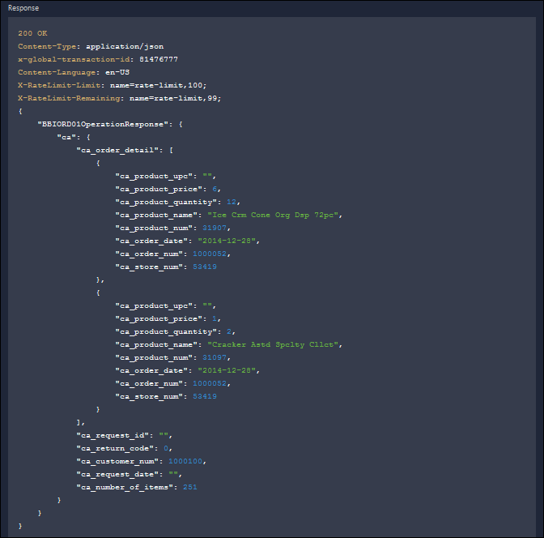

# Part one:  Test Breadbox API 
Use the API Connect Developer Portal to test the **GET /customerHistory** operation of the Breadbox API.  This operation retrieves customer purchase history and will be used in Part two of this journey.   

## Get started with IBM Developer API Portal

1. Sign up for an [IBM ID] if you don't have one already. This is required for the next step.
2. Go to the [IBM Developer API Portal].
3. Create an account if you have not done do already.

   
   
   * Click **Create an account**.
   * Provide all required information.  Be sure to use your IBM ID (Email) for this account.
   * Click **Submit**.
   
   An account activation email will be sent to your registered Email. Click on the link in this email to activate your account before. 
   
4. Login to your account. 

5. Create a new application (work space for this project).  

   
   
   * Click **Apps** from the menu. 
   * Click **Create new app**. 
   * Fill in all required fields. 
   * Click **Submit**.
   
   Make a note of the client ID and client secret. You will need them to access the API later in Part two. 
   
   
   
     
6. Display a list of available API products.
   
   * Click **API Products** from the top menu.
        
   
   
## Work with the Breadbox API
   
1. Select the **Breadbox** product.
   * Click **Breadbox**. 
   
   
   
   From the left navigation panel, you will see one published API named **breadbox team dinosaur**.

2. In order to work with this API, you must subscribe to it first.
   * Click **Subscribe** for the Default Plan.
   * Select the app that you have just created.
   * Click **Subscribe**
   
   
   
   
3. Let's take a closer took at this API. 
   * Click **breadbox team dinosaur**.
   
   
   
   This page has 3 sections:
   * The left panel is the navigation panel that lists all the available operations and their definitions.
   * The middle panel displays detail information for the item you have selected.
   * The right panel contains sample code in various programming languages.    
  
4. This API has one operation **GET /customerHistory"**.  
    * Click **GET /customerHistory"**.
    
    
    
    This operation retrieves purchase history for a customer. The required parameters and their formats are described.
  
5. Generate code to test this operation.  Go to the right panel.
    * Click a programming language that you want to work with.
    
    
    
    Code example in the selected programming language and an example output of a successful response are displayed.  You can copy the code and use it in your own application. 
    
    
    
6. Test the **GET /customerHistory"** operation with the generated code.    
    * Scroll down to **Try this operation** section.  Fill in the following:
    
      | Field           | Value                      | Comment                                         |
      | --------------- | -------------------------- | ----------------------------------------------- |
      | Client ID       | ID of the application      | Should be defaulted to the one you just created |
      | Client secret   | Secret for the application | Secret generated when app was created           |       
      | customer_number | 1000100                    | Valid #s are 1000100-1000140                    |        
      | request_date    | 2013-09-01                 | Purchase history since this date                |        
      | shorten         | 2                          | Number of records to retrieve                   |       
       
    * Click **Call operation**.
    
    
    
    You should see the output returned at the bottom of the page.
    
    

:thumbsup: Congrtulations!  You have successfully tested the Breadbox API and ready to move on to part 2 of this journey.
