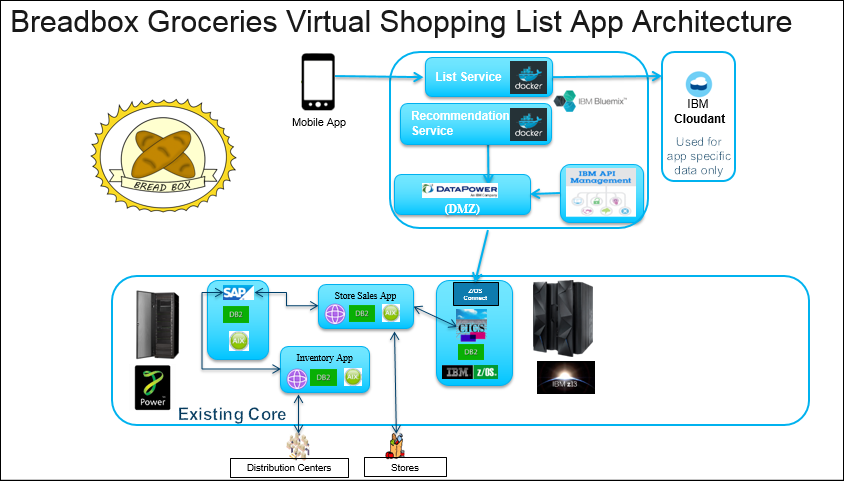
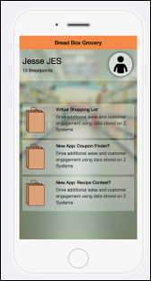
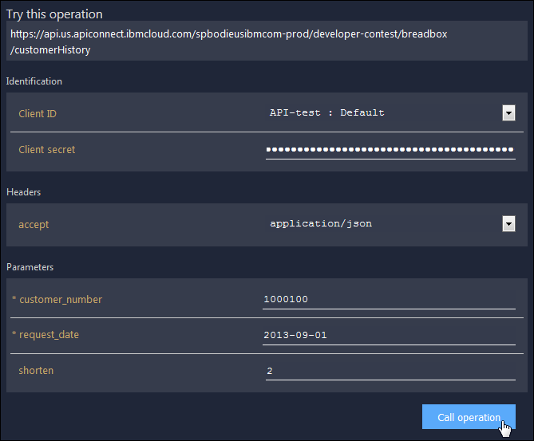
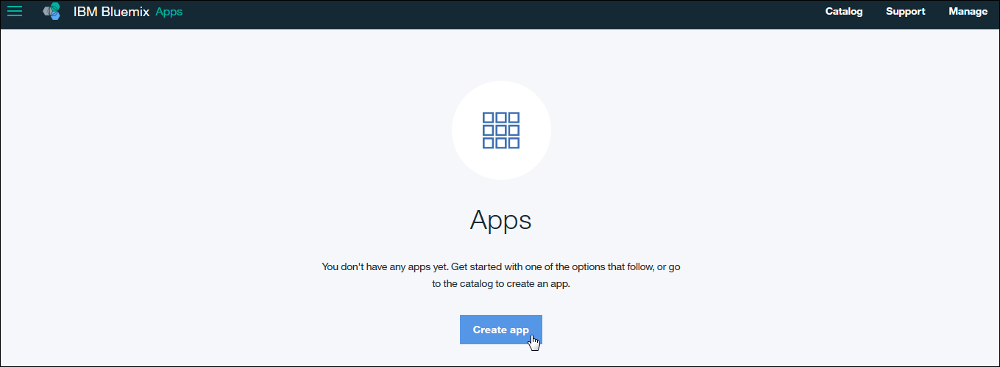
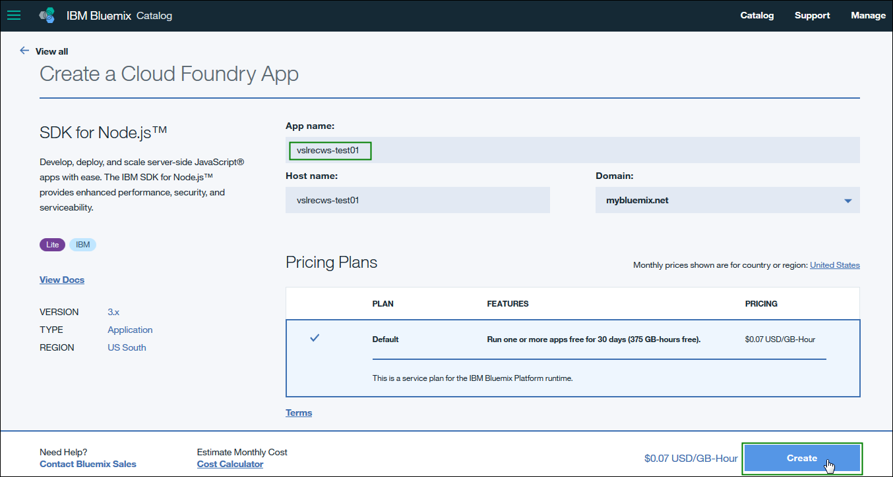
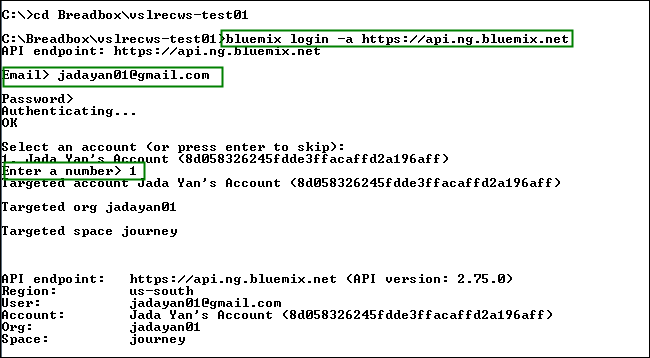
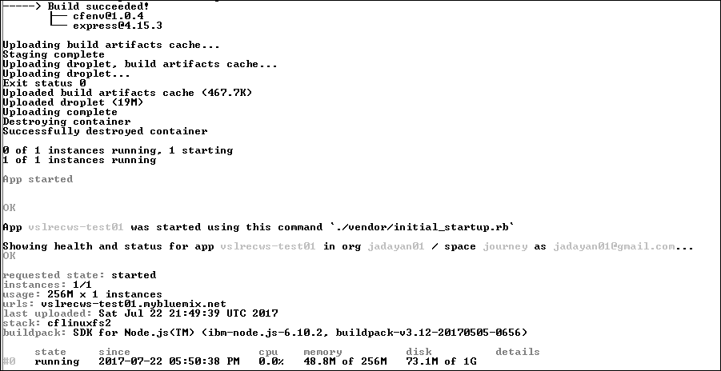

# Increasing retail store revenues using IBM Z hybrid cloud
## Overview

To showcase the business challenges that a typical retail company might be experiencing, we share a case study about a fictitious retail company, which we refer to as **Breadbox Groceries**.  


Today, they run three data centers across the country with IT reaching into the stores and distribution centers as well.  In the data centers, they host their core Business Support Systems on IBM Z. Supporting applications are hosted on IBM CICS® and IBM z/OS® Db2 systems.

One of the initiative for Breadbox was to implement the **virtual shopping list**. With this app, customers will be reminded that they need milk at the store the next time they go based on the purchasing history. 


## Architecture

This diagram shows the Virtual Shopping List mobile application and two supporting microservices or web services: The Virtual Shopping List List Web Service (vsl-list-ws) and the Virtual Shopping List Recommendation Web Service (vsl-rec-ws).  

* The Recommendation Service is a simple recommendation engine, that finds patterns in customer’s purchases, mostly around durations between purchases, and makes recommendations for new purchases.  

* The List Service supports the mobile phone app (breadboxportal), by managing and persisting the list seen on the mobile phone app, merging in customer added items with customer selected recommendations.  

App users can add or ignore recommendations, can enter free form items, and can delete items at any time.  List Service has the smarts, and uses a  Cloudant database behind it, to maintain the current list.




## Scenarios

**Part one:** Use the API Connect Developer Portal to test the **GET /customerHistory** operation.  This operation retrieves customer purchase history.  It will be used in Part two of this journey.   

**Part two:** Deploy the Virtual shopping list mobile application and associated web services in IBM Bluemix.

## Included components
  
* [IBM Z Mainframe] ([IBM Z Mainframe Redbook] & [IBM Z Mainframe developerWorks])
* [IBM z/OS] ([IBM z/OS Knowledge Center])
* [IBM CICS Transaction Server] ([IBM CICS TS Knowledge Center] & [IBM CICS TS developerWorks])
* [IBM z/OS Connect Enterprise Edition] ([IBM z/OS Connect EE Knowledge Center] & [IBM z/OS Connect EE developerWorks])
* [IBM Db2] ([IBM Db2 Knowledge Center])
* [IBM Bluemix]
* [IBM API Connect] ([IBM API Connect Knowledge Center] & [IBM API Connect developerWorks])
* [IBM Cloudant]

# Part one:  Test Breadbox API 
Use the API Connect Developer Portal to test the **GET /customerHistory** operation of the Breadbox API.  This operation retrieves customer purchase history and will be used in Part two of this journey.   

1. Sign up for an [IBM ID] if you don't have one already. This is required for the next step.
2. Go to the [IBM Developer Portal].
3. Create an account if you have not done do already.

   
   
   * Click **Create an account**.
   * Fill out the information.  Be sure to use your IBM ID for this account.
   * Click **Submit**.
   
   You will receive an account activation email. You need to click on the link in this email to activate your account before you can login. 
   
4. Login to your account. 

5. First, you must create a new application (your work space for this project).  

   
   
   * Click **Apps** from the menu. 
   * Click **Create new app**. 
   * Fill in all required fields. 
   * Click **Submit**.
   
   Make a note of your client ID and client secret. You will need them to access the API later. 
   
   
     
6. Display a list of available API products.
   * Click **API Products** from the top menu.
        
   
   
7. You will be working with the **Breadbox** product.
   * Click **Breadbox**. 
   
   
   
   From the left navigation panel, you will see one published API named **breadbox team dinosaur**.

8. In order to work with this API, you must subscribe to it first.
   * Click **Subscribe** for the Default Plan.
   * Select the app that you have just created.
   * Click **Subscribe**
   
   
   
   
9. Let's take a closer took at this API. 
   * Click **breadbox team dinosaur**.
   
   
   
   This page has 3 sections:
   * The left panel is the navigation panel that lists all the available operations and their definitions.
   * The middle panel displays detail information for the item you have selected.
   * The right panel contains sample code in various programming languages.    
  
10. This API has one operation **GET /customerHistory"**.  
    * Click **GET /customerHistory"**.
    
    
    
    This operation retrieves purchase history for a customer. The required parameters and their formats are described.
  
11. Generate code to test this operation.  Go to the right panel.
    * Click a programming language that you want to work with.
    
    
    
    Code example in the selected programming language and an example output of a successful response are displayed.  You can copy the code and use it in your own application. 
    
    
    
12. Test the **GET /customerHistory"** operation with the generated code.    
    * Scroll down to **Try this operation** section.  Fill in the following:
    
      | Field           | Value                      | Comment                                         |
      | --------------- | -------------------------- | ----------------------------------------------- |
      | Client ID       | ID of the application      | Should be defaulted to the one you just created |
      | Client secret   | Secret for the application | Secret generated when app was created           |       
      | customer_number | 1000100                    | Validate #s are 1000100-1000???                 |        
      | request_date    | 2013-09-01                 | Purchase history since this date                |        
      | shorten         | 2                          | Number of records to retrieve                   |       
       
    * Click **Call operation**.
    
    
    
    You should see the output returned at the bottom of the page.
    
    

:thumbsup: Congrtulations!  You have successfully tested the Breadbox API and ready to move on to part 2 of this journey.

# Part two: Deploy the Virtual Shopping List web application

This section take you through the steps to install the Breadbox Groceries sample mobile web application and associated web services in IBM Bluemix.  

## Prerequisites

Before proceeding, please ensure you have met all of the following prerequisites:

* Complete Part 1 of this journey.
* Sign up for a [Bluemix account].
* Install the [Bluemix CLI] tools. 


## Step 1:  Create three place holder apps in Bluemix Cloud Foundry Database

1. Login to your [Bluemix account].

### Create a new App for the Virtual Shopping List Recommendation Web Service (vslrecws)

1. From the main Apps dashboard, click **Create App**.   
   
   
   
2. In the left navigation pane, click **Cloud Foundry Apps**.  
   
3. Select **SDK for Node.js**.
   
   
   
4. For App name and Host name, fill in **vslrecws-something-unique**
   
   *IMPORTANT:  The Host name must be unique across all of the bluemix.net domain.  Bluemix should enforce this uniqueness, by checking for any prior users, before creating the placeholder Cloud Foundry applications. We recommended that you use the following format, vslrecws-something-unique where something-unique is a sequence number, or project nickname, or developer nickname, etc., such as vslrecws-dev02 or vslrecws-test03.*
   
5. When ready, click **Create**.
   
   
   
   The app is now Running!    
   
   
   
6. Click **Visit App URL** to test it.
   
   
   
   You have just instantiated a simple template Hello world web application.  
   
7. Download the node.js app code. 
   * Click **download the sample code**.  
   * Save the code to your computer.
   * Unzip the file to a directory.
   
10. Go to a terminal and navigate to the sample code directory.
   
11. Authenticate to Bluemix.
    * **bluemix login –a https://api.ng.bluemix.net**.
    * Enter your Bluemix account.

    
   
12. Push the unchanged code for the sample node.js app we created earlier to Bluemix.
    * **bx app push vslrecws-somethingunique**. 
      
    When processing completes, your app will restart.  You should receive messages similar to the following: 
      
    
      
13. Return to the Bluemix portal and navigate the the Cloud Foundry Apps. You should see the vslrecws app you just created.
      
14. Click on the route to load the URL into your browser to make sure that the node.js sample app is still healthy.  
   
    

### Create a new App for the Virtual Shopping List Listing Web Service (vsllistws-somethingunique) 

1. Repeat the steps in the previous section to create the Virtual Shopping List Listing Web Service App.

### Create a new App for the Breadbox portal (breadboxportal-somethingunique).

1. Repeat the steps in the previous section to create the Breadbox portal App.

2. When this step is complete, you should see these three apps in you Cloud Foundry App list.

   

## Step 2:  Configure, Connect the Virtual Shopping List Cloudant Database	

1. Create the Cloudant database service.
Choose Cloudant NoSQL DB from the Service Catalog, Data & Analytics sectio.
Select the Lite plan.
Click the Create button.
Important, make sure to use the name “cloudantconfig” for the name of the service!!
The cloudantconfig instance of the Cloudant NoSQL-DB service is now in place.


2. Create Virtual Shopping List databases in the Cloudant service.

Select the Cloudant service from the Bluemix Services list.
Navigate to the Manage tab on the left navigation pane.  Click the Launch button to launch the Cloudant management UI in a separate browser tab.
Navigate the the Databases view, via the left navigation pane, and click Create Database in the upper right corner.
Create a database named “rec” (short for recommendation).  This database will hold purchase recommendations, based on customer purchase history.
Repeat the process to create the “users” and “vsl” (short for  Virtual Shopping list) databases.  The “users” database stores basic user information and breadpoints.  Currently, a new user must be manually added to this database, using the Cloudant UI, in order to use the Breadbox Virtual Shopping List portal/mobile application.  This may help keep bots from trolling the portal/mobile app.  The “vsl” database holds shopping list items the user manually adds to their list.

3. Populate a user in the users database.

Select the “users” database.
Select the All Documents plus sign (+)
Select New Doc.
Copy/paste the sample text below over the existing text:
``` 
{
  "_id": "074",
  "customerid": 1000114,
  "ibmid": "jessejes@example.com",
  "breadpoints": 10,
  "realname": "Jesse JES"
}
```
_id should be between “001” and “100”.
 
customerid should be between 1000100 and 1000140 (inclusive: 1000100 and 1000140 are valid)
 
ibmid should be a valid email address.  
 
breadpoints should be a valid number.
 
When finished, click the Create Document button.
The new user is now in place.

 


4. Create Cloudant Credentials to use in the Breadbox VSL app.

Navigate to the Service credentials tab in the left navigation pane, and click New credential (+) in the upper right.
Provide a name for the credentials, and click the Add button in the lower right.
The credential is now in place.
You can use the View credentials Action to view the assigned credential.  These will be used later.

5. Connect Cloudant Credentials to the Breadbox VSL app.	 

Navigate to the Connections tab in the left navigation pane, and click Create connection (+) in the upper right.
Select the breadboxportal app, and click on the Connect button in the lower right hand corner.
Click on the Restage button.
The Cloudant NoSQL DB service is now connected to the breadboxportal app.
To see the results of this new Connection, navigate back to the Breadboxportal application.  (Maybe use Dashboard from the main menu button (hamburger in the upper left corner of all Bluemix screens).
Now, for the breadboxportal app, navigate to the Runtime tab in the left navigation pane, and click Environmental variables  in the center selector.
We see the cloudantNoSQLDB environment variable, that will be passed to the breadboxportal Cloud Foundary application, so that credentials don’t need to be in the code.  It’s a little odd that that the VCAP_SERVICE environment variable above isn’t cloudantconfig, to match the service name, but it works somehow.  ;-)
 
Repeat this process to connect the cloudantconfig service to the vsllistws and vslrecws Cloud Foundry apps.


## Step 3:  Create the VSL app shared secret user defined environmental variable 

Navigate to the Runtime tab in the left navigation pane, and click Environmental variables  in the center selector for the breadboxportal app.
Scroll down to show the User defined section of the Environmental variables.
 
Using the Add button, create a new user-defined environmental variable.  Use the JWT_SHARED_SECRET name and create a 20 character, random string of upper, lower case characters, numbers, for the value, with a JSON form, similar to this:  { "secret": "MaKE1me2RanDOm345678" }
 
When ready, click the Save button.  The app should be restarted automatically.
 
Repeat this process for the vsllistws and vlsrecws web services.  The JWT_SHARED_SECRET needs to be identical across breadboxportal, vsllistws, and vslrecws.  This shared secret is used to encrypt and decrypt the JSON web token (JWT) passed between breadboxportal, vslistws and vslrecws.


## Step 4:  Get real

### Switch to the actual working code	 
	 
In this section, we are going to upload the actual working code, to overlay the placeholders created earlier.  
 
This section assumes the sample code has been downloaded and unzipped.
 
There are five manual edits to make to the sample code to have it match the Hosts you created in Part 1.   Three edits are in manifest.yml files, and two edits are in server.js files so make sure to complete the steps marked IMPORTANT below.
 

   IMPORTANT:  The Host used in the Route section earlier must be inserted into the three manifest.yml files for the breadboxportal application and the vsllistws and vslrecws web services.
   
   The host value above must be the unique Host created before for all three “apps”.


   IMPORTANT:  The Host used in the Route section earlier must be inserted into the server.js files for the breadboxportal application and the vsllistws services.   The URL for the vsllistws goes in breadboxportal/server.js and the URL for the vslrecws goes in vsllistws/server.js.  To have these not hard coded in the code, they really should be environment variables.  ;-)

IMPORTANT:  When issuing the bx cf push commands, its very important to issue the commands for a given application from within the directory for that application.  If this is not done, application hosts get cross wired, and your applications will start to be unreachable intermittently, as Bluemix seems to associate multiple routes with the same application, when a cross wired push is done.  If cross wiring occurs, the Bluemix portal can be used to edit the application routes, and delete unintended routes.  Use the Routes button in the upper left corner of any detailed views (Overview, Runtime, Logs, etc.) for the application.


Here’s a sample session for pushing the actual code to Bluemix:
 
daves-mbp:breadboxportal davewilloughby$ pwd
/Users/davewilloughby/Downloads/zhack/breadboxportal
daves-mbp:breadboxportal davewilloughby$ bluemix login -a https://api.ng.bluemix.net
bx app push breadboxportal
   
As one quick check for proof that the actual working Breadbox Recommendation Service is running.  Navigate to your hos, similar to vsl-rec-ws2.mybluemix.net route in your browser.

### Connect to the API from the Developer Portal


In this section, we want to make sure the Breadbox Recommendation web service is talking to the API available in the Developer Portal.
 
Return to your source code directory for the Recommendation web service and edit the server.js file.
 
Look for the section that calls analyze-history, and check the particulars, such as URL and client ID match the ones from the Developer Portal.  There’s a bit of hard coding here, which isn’t the best, but it keeps things simple and clear. 

When finished editing, do another push of the Recommendation web service code to Bluemix, using bx app push vslrecws, or similar.

### Test Breadbox Hybrid Cloud application End to End 

Now we are ready to see the final result, the full hybrid cloud application from Bluemix all the way back to z/OS Connect.
 
Navigate to the breadboxportal route in your browser.  
 
Use the unique Route Host you created before for the breadboxportal app.

Click the Login button at the bottom of the screen above.  This sample portal, mobile application lacks user login.  Developers may choose to add user login themselves.  The sample redirects directly to the mobile application screen.  

User authentication is a very common way to protect your app from bots on the Internet, besides authenticating known users. Facebook, Google authentication could also be used, or your company’s SSO.  SSO saves individual app builders from creating their own user management – a big relief!!

Then select the Virtual Shopping List app on the mobile phone

The top two rows are recommendations coming from Andre’s Recommendation web service based on the customer purchase history coming from z/OS Connect!
 
You can use the plus (+) sign to add recommendations to your shopping list.  The shopping list is persisted in the cloud, in the Cloudant database.
To get further validation that our integration of the engaging mobile app in the cloud, with the customer purchase history on the zSystems, we can double check the Recommendation web service log in Bluemix to see the recommendations coming from the analyze-history call. 

We can also see the raw response from the API on the Developer Portal.

As a follow up to the creation of a user in the Cloudant data base, we can now look behind the scenes to see that the Cloudant tables are all working correctly.

Here’s how the portal, mobile app will look after user jessejes@example.com has been on-boarded into the Cloudant user table:

Jesse already has 19 Breadpoints, after 19 logins!
 
Click the Virtual Shopping List application.

Jesse’s purchase recommendations are shown.

Use the “Add an item…” dialog and click the plus sign (+) to manually add an item.

The “rec” and “vsl” databases are self-priming, based on use of the portal, mobile app.  Using the Cloudant management UI, we can make sure the databases are working properly.


Navigate back to the Cloud management UI, and navigate to the Databases view.  Select the users table.  Referenc Part 2 of this document as needed, to remind yourself of this navigation.

Click the pencil in the upper right to view/edit the document for Jesse JES. 
Jesse now has 21 breadpoints!

The item “shrimp cocktail” that Jesse JES added manually to his virtual shopping list is now in the “vsl” database.

## Step 5:  Extend the Recommendation Service	 

This section is more free form, improvisational.   Your team can talk about ways the Recommendation Service would be extended to use other algorithms, that might serve the Virtual Shopping List better, or serve other mobile applications, maybe serve applications in your company.
 
The current recommendation engine focuses on durations between purchases.  Maybe it should also factor in quantities, price, store number?
 
Maybe the Recommendation Service is cloned and changed internally to be a Advertisement Service or an Announcement Service.  Maybe the List Service, besides calling the Recommendation Service, it also calls the Announcement Service and the Advertisement Service.  Multiple simple services embraces the microservice architecture.  How would you build these new services?  What would they consider, that’s on the mainframe, and what’s available from other parts of the Breadbox Groceries company, or available on the Internet?
 
Once the design “Hills” are decided by the line-of-business, Andre, the cloud developer could easily create these new web services.
 
To make the point, we can do a little hands-on here too.
 
We can go back to our source code for vsl-rec-ws, and look at analyser.js.  As coded, it shows a programmable “depth” that you might try changing, and re-pushing the new code to Bluemix.  Some testing has shown that with the depth set higher in analyzer.js, the recommendation service does return more recommendations, but so far, these don’t reach the mobile phone screen – the plot thickens.  Maybe there’s an issue with the List Service, but I think we want to stick to just one service for this workshop, before we get in too deep.  At least with a higher depth, look at the log for your recommendation service, to see more recommendations coming back!!
 

Microservices is a key architecture for keeping modularity, agility, and scaling.  As application uses grows, additional instances of microservices can be spawned, with load balancing between them.
 
Here’s a quick way, that’s cheating, but shows a possibility, on how to insert special prices, deals for customers, perhaps the beginning of an Announcement Service.
 
Here’s the result on the mobile phone application, a little bit of a cheat, but an easy code change you can make and push to Bluemix.

If there’s a node.js developer on the team, more interesting extensions could be prototyped quickly in this environment.

## Step 6:  IBM Watson Analytics on Breadbox Customer Purchase History	 

In this section, we will explore how Nathan, the Breadbox Groceries data scientist, can explore and gain insights from Breadbox Groceries customer purchase history.  This data exploration can have immense business value, looking for trends, such as products selling well, not so well, for specific customers, trends in customer retention, customer purchase volume per visit, customer visits to more than one store – the possibilities are endless.  Armed with insights, Breadbox Groceries might use the Virtual Shopping List mobile application to insert promotions to target customers, that might improve number of visits, quantity of purchases per visit, etc.  After the promotion period, the results can be measured by further analytics on customer purchase history.  In this section, we’ll use the API we created, to gather customer purchase history for various customers, feed that information into IBM Watson Analytics, running in the IBM Cloud, to see what types of insights are possible.

Gather, format Breadbox customer purchase history
 
In the first Experience, we saw how Shavon created developer APIs.  The customerHistory API returns a large json document.  The API returns data for a single customer.  Each team can pick a different customer number, so that we have several different results in IBM Watson Analytics.
 
One tricky part is that IBM Watson Analytics doesn’t process json (booo!), so we will convert the API json response to CSV, or your team can skip this step and use previously gathered customer purchase history in CSV form.
 
Here’s a curl run against Shavon’s API, which should look familiar by now.
 
curl --request GET   --url 'https://api.us.apiconnect.ibmcloud.com/bblabz00-dev1/breadbox/breadbox/customerHistory?customer_number=1000100&request_date=2013-09-01'   --header 'accept: application/json'   --header 'content-type: application/json'   --header 'x-ibm-client-id: 0e1878a7-79f1-419e-8cca-d57b76a54b7a'

Individual teams can pick unique customer numbers.  Valid customer numbers are from 1000100 to 1000140, so teams can pick a customer number in this range.
 
There are a number of tools, techniques to do an API request.  Using curl is shown here.  Other approaches include using the Chrome postman plug-in.
 
Also, there likely are several ways to convert json to csv.  In this section, node.js is used, at the command line.
 
Node.js has wide usage, and a lot of existing modules to do just about anything a node programmer needs.  A simple google search often finds a good candidate node module.  
In this example, a json2csv node module was used, found at: https://github.com/zemirco/json2csv#command-line-interface

json2csv can be installed in your node environment with:  npm install –g json2csv –-save

Here’s a sample session to convert json to csv at the command line, using the node module json2csv.  

IMPORTANT:  One slightly hidden step is to trim the json response to only the details portion of the response (ca_order_detail), the main part of the response, the long array of strings, between the square brackets:  [  … ].  The vi editor is used to remove the front and back matter, to leave the square brackets and everything in between.  The red box below shows the front matter removed in the vi session.  Make sure to trim the back matter too, so that the data starts and ends with the square brackets.  The head command is used to show a brief portion of a very large file, to show the before and after for the vi session, and the resulting .csv file.  Someone could create a sed regex command to trim the front and back matter.  ;-)
 
The use of node.js is quite pervasive and continuing to climb.  
 
Take a look on http://www.modulecounts.com/.  

Applications and Utilities can be written so quickly in node.js, since there’s often exactly the module you are looking for to achieve the desired functionality.
 
This helps Andre as a cloud developer, with the strong ecosystem for node.js.
 
Someone was able to quickly help Nathan, to reformat the json data, so that he had csv data.  A quick google search found json2csv, a simple npm install installed, and swoosh, a quick pipeline for converting data to the right format.
 
While we did this by hand, Andre could create microservice for the conversion, and another microservice to upload to IBM Watson Analytics programmatically, rather than manual.  Before long, an Analytics pipeline emerges after a few quick development steps.

Login to IBM Watson Analytics, upload data

You can login to IBM Watson Analytics here:
 
https://www.ibm.com/analytics/watson-analytics/us-en/

Use your IBMid to login.
 


 


You may have to use the Try it for free button, to reach the dashboard.


Select New data in the upper left.

 

Choose Local file and select Browse
 
 

and use your OS file chooser to select your .csv files, and then click Import in the bottom left.
 
 


The click on the tile for the .csv just uploaded
 
 
 

 
Generate Insights

Various Starting points are shown.  You can begin your data exploration, trying out various things you see, and see what you can come up with.
 
 
 


Here’s are a few examples.

This customer really likes Honeyed Preserve.
 
 


This customer buys mostly in Store 4 and 5, and really likes Tea Lemon Ginger.

 


This customer is spending more lately  ;-)
 


---
:thumbsup: Congrtulations!  You have successfully completed deployment of the Virtual Shopping List web application. The purpose for this sample app is a starting point for additional “hacks” that can be done.  Here’s some ideas on possible hacks:

1. Convert to a fully mobile optimized web application – a full phone/tablet web app.
2. Add Google or Facebook authentication
3. Add contests, reward programs
4. Improve the recommendation engine: better algorithms, consider other facts like day of the week, season, location, drive coupons, specials to the user
5. Analytics on customer purchase history to find, track customer retention issues, etc.
---

[IBM Z Mainframe]: https://www-03.ibm.com/systems/z/
[IBM Z Mainframe Redbook]: https://www.redbooks.ibm.com/redbooks.nsf/pages/z13?Open
[IBM Z Mainframe developerWorks]: https://developer.ibm.com/mainframe/

[IBM z/OS]: https://www-03.ibm.com/systems/z/os/zos/
[IBM z/OS Knowledge Center]: https://www.ibm.com/support/knowledgecenter/en/SSLTBW

[IBM CICS Transaction Server]: https://www-01.ibm.com/software/data/enterprise-application-servers/cics/
[IBM CICS TS Knowledge Center]: https://www.ibm.com/support/knowledgecenter/en/SSGMGV
[IBM CICS TS developerWorks]: https://developer.ibm.com/cics/

[IBM z/OS Connect Enterprise Edition]: https://www.ibm.com/ms-en/marketplace/connect-enterprise-edition
[IBM z/OS Connect EE Knowledge Center]: https://www.ibm.com/support/knowledgecenter/en/SS4SVW
[IBM z/OS Connect EE developerWorks]: https://developer.ibm.com/mainframe/products/zosconnect/

[IBM Db2]: https://www.ibm.com/analytics/us/en/technology/db2/?lnk=STW_US_SHP_A4_TL&lnk2=learn_DB2
[IBM Db2 Knowledge Center]: https://www.ibm.com/support/knowledgecenter/en/SSEPEK/db2z_prodhome.html

[IBM API Connect]: http://www-03.ibm.com/software/products/en/api-connect
[IBM API Connect Knowledge Center]: https://www.ibm.com/support/knowledgecenter/en/SSMNED 
[IBM API Connect developerWorks]: https://developer.ibm.com/apiconnect/

[IBM ID]: https://www.ibm.com/account/us-en/signup/register.html
[IBM Developer Portal]: https://developer-contest-spbodieusibmcom-prod.developer.us.apiconnect.ibmcloud.com/

[IBM Bluemix]: https://www.ibm.com/us-en/marketplace/cloud-platform
[Bluemix account]: https://console.ng.bluemix.net/
[Bluemix CLI]: https://clis.ng.bluemix.net/ui/home.html

[IBM Cloudant]: https://www.ibm.com/analytics/us/en/technology/cloud-data-services/cloudant

